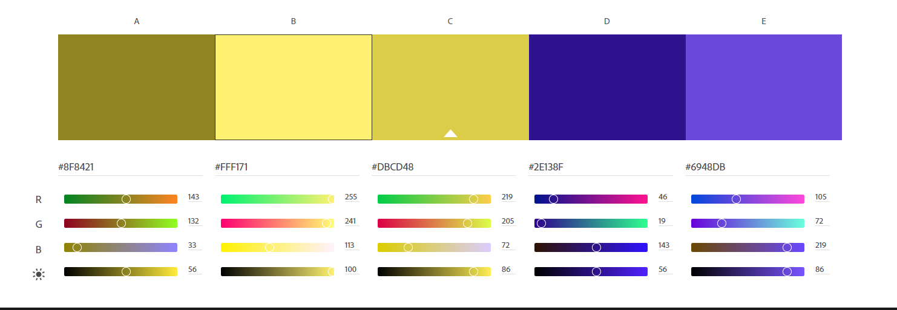

# README

Andrew Parvaneh

## Description

This is a project that I made to show what I have learned in my web Page development class. I have been able to acquire many new skills since the start of the class. Those skills are...

•	Understanding files and folders and learning their hierarchy system.

•	Identify what Integrated Development Environments are and how to create and manage project files in workspaces.

•	Learned about copyright as well as downloading and uploading files.

•	HTML and its backstory as well as what it can do and how important it is to know how to use it. 

•	What the Development Inspector is and how to access it. As well as JavaScript Console and basic scripting errors.

•	The rate at which websites have been increasing since their creation, and how to insert a graph into a document. 

•	What Git and GitHub were used for. As well as how to use them for projects.

•	What Netlify is used for, how to use it and how to link it to your GitHub.

•	How computer networks work and how the parts are connected. 

•	Learned about CSS and how it works as well as why it was created and the role it serves.

•	Accessibility and how important it is when creating your site. Learned how to approach different types of disabilities such as      color blindness, dyslexia, physical injuries, and many others.

•	How images elements, tags, and their basic attributes work together.

•	What the Box Model is and how to use it.

•	What pseudoclasses and pseudoelements are and how to identify them.

•	The importance of building your websites mobile first and how important it has become to have your site be able to be viewed from different types of devices. Responsive Design is such an important aspect to remember when making a website. 

•	Learned the history of Floats, Flexbox, and Grid, and how to use them.

•	Embedded media and how to use the <iframe> <video> and <audio> tags.

•	Codepen what it is and how to use it. 

•	The form and function of interface elements and how to use design documentation as a blueprint to plan ahead. Also learned about the C.R.A.P. principals and how to make use of them.

•	How to use tables to display structured data and how to use forms to build interface elements with code.

•	Transitions and basic transforms and how to make animation from CSS transform properties and CSS transitions.

•	How the major navigation paradigms and mobile navigation paradigms. As well how to make and use a navigation bar.

## Roadmap

I am not finished with my website. I plan on improving it as I continue to learn more and more. Hopefully as I improve my skills, I will be able to make the site fantastic.

## Contributing:

For the time being I am not open to contributions. I want to see what I can improve on before I open it up to others.

## Color Scheme:

For my color scheme I did yellowish colors for the background and purplish colors for the text. The purplish colors didn’t end up working out, so I replaced them with black.  The first color had an RGB of 143, 132, 33 and had a hex code of #8F8421. The next color had an RGB of 255, 241, 113 and a hex code of #FFF171. The final of the yellow colors had an RGB of 219, 205, 72 and a hex code of #DBCD48. The first purple color had an RGB of 46, 19, 143 and a hex code of #2E138F. The other purple color had an RGB of 105, 72, 219 and a hex code of #6948DB.

